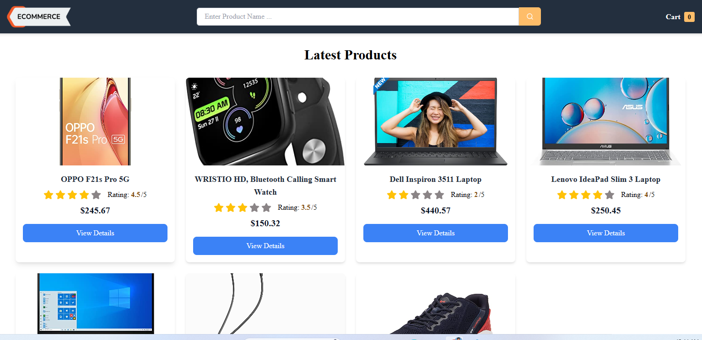
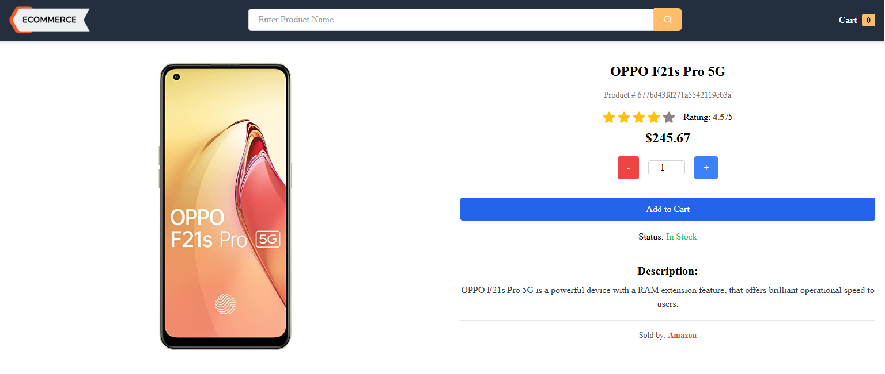
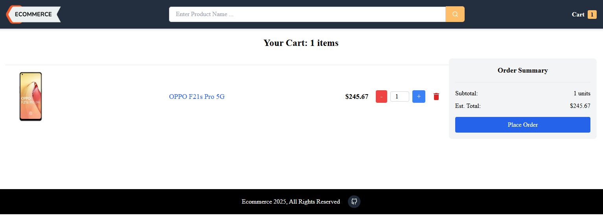

# Mini E-commerce App

A mini e-commerce application built using the **MERN stack** (MongoDB, Express.js, React.js, Node.js). This project demonstrates the basic functionality of an e-commerce platform, product management, and cart management.

## Features

- **Product Management:** View a list of products with details like name, description, price, and image.
- **Cart Management:** Add products to the cart, update quantities, and remove items.
- **Admin Panel:** Admin users can add, update, or delete products.
- **Responsive Design:** Optimized for both desktop and mobile devices.

---

## Tech Stack

### Frontend

- **React.js**: Frontend framework for building the user interface.
- **Tailwind CSS**: Styling and responsiveness.

### Backend

- **Node.js**: Backend runtime environment.
- **Express.js**: Web framework for API development.
- **MongoDB**: Database for storing application data.
- **Mongoose**: ODM for MongoDB.

---

## Installation and Setup

### Prerequisites

- Node.js (v16 or later)
- MongoDB (local or cloud instance)
- A code editor like VS Code

### Steps

1. **Clone the repository**:

   ```bash
   git clone https://github.com/your-username/mini-ecommerce-app.git
   cd mini-ecommerce-app
   ```

2. **Install dependencies**:

   - For the backend:
     ```bash
     cd backend
     npm install
     ```
   - For the frontend:
     ```bash
     cd frontend
     npm install
     ```

3. **Set up environment variables**:
   Create a `.env` file in the `backend` directory with the following variables:

   ```env
   PORT=5000
   MONGO_URI=<Your MongoDB URI>
   ```

4. **Start the application**:

   - Start the backend:
     ```bash
     cd backend
     npm run server
     ```
   - Start the frontend:
     ```bash
     cd frontend
     npm run dev
     ```

5. **Access the app**:
   Open your browser and navigate to `http://localhost:3000`.

---

## Folder Structure

### Backend (`/backend`)

- `models/`: Mongoose models for users, products, etc.
- `routes/`: Express routes for handling API requests.
- `controllers/`: Logic for handling business operations.
- `lib/`: Configuration files (e.g., database connection).

### Frontend (`/frontend`)

- `src/components/`: Reusable React components.
- `src/pages/`: Application pages (e.g., Home, Product Details, Cart).

---

## API Endpoints

### Authentication

- `POST /api/users/register`: Register a new user.
- `POST /api/users/login`: Authenticate a user.

### Products

- `GET /api/products`: Fetch all products.
- `GET /api/products/:id`: Fetch details of a single product.
- `POST /api/products` (Admin only): Add a new product.
- `PUT /api/products/:id` (Admin only): Update product details.
- `DELETE /api/products/:id` (Admin only): Remove a product.

### Cart

- `POST /api/cart`: Add a product to the cart.
- `GET /api/cart`: Fetch cart items for a user.
- `PUT /api/cart/:id`: Update item quantity in the cart.
- `DELETE /api/cart/:id`: Remove an item from the cart.

---

## Screenshots

## Screenshots

1.  **Home Page**: Displaying a list of products.  
    (https://e-commerce-app-1-2cpw.onrender.com/)

2.  **Product Details**: Detailed view of a selected product.  
    

3.  **Cart Page**: List of items in the user's cart.  
    

---

## Future Enhancements

- Add payment gateway integration (e.g., Stripe, PayPal).
- Implement order management.
- Improve product filtering and search functionality.
- Add user profile management.
- User authentication and authorization

---

## Contributing

Contributions are welcome! Please fork the repository and submit a pull request.

---

## License

This project is licensed under the MIT License. See the `LICENSE` file for details.

---

## Contact

For any questions or feedback, reach out to **Dinesh** at [dineshinmecheng@gmail.com].
